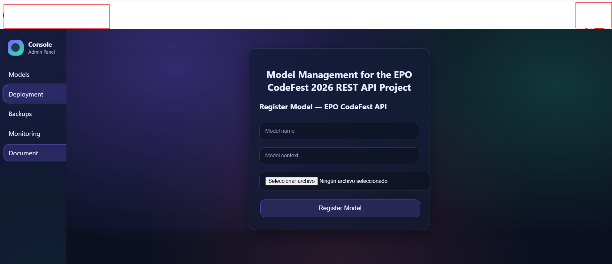
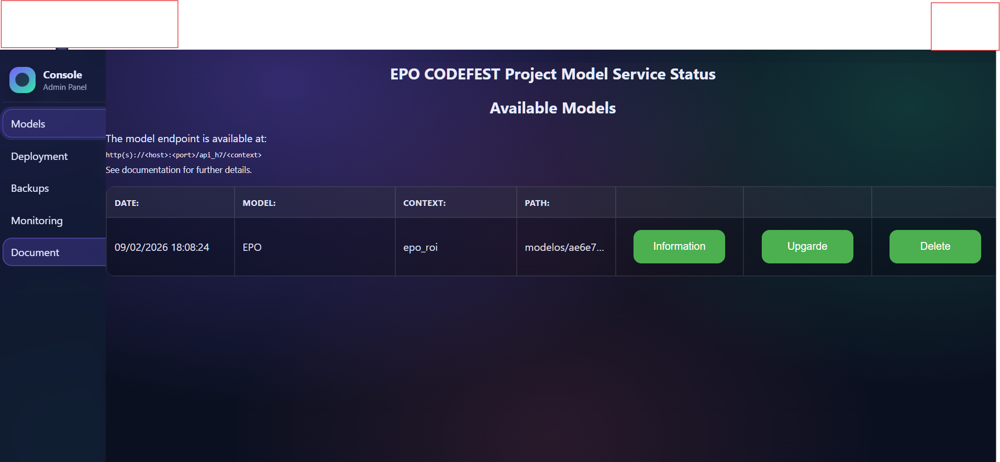
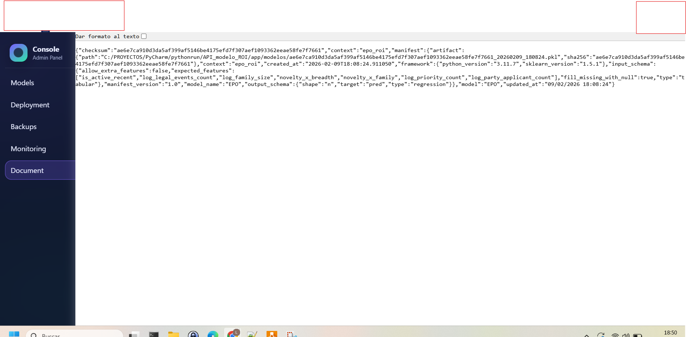
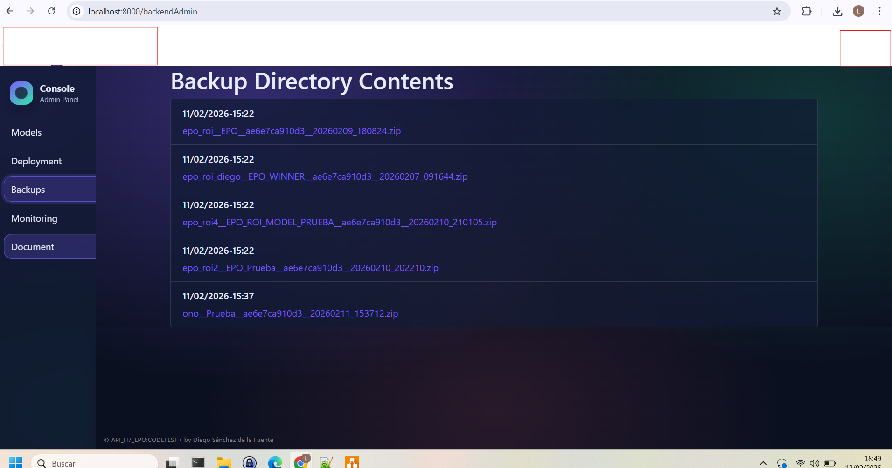
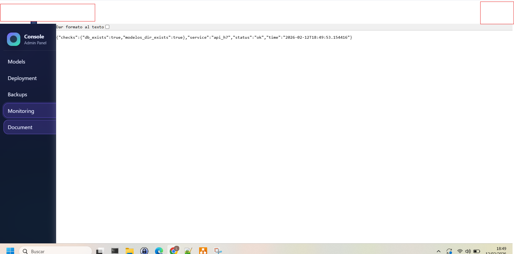

# API_modelo_ROI H7
## MLflow-Style Model Manager & Production REST Service  
Heptagon Governance Framework

---

# Overview

`API_modelo_ROI` is a lightweight, production-oriented model management and serving system developed for the EPO CodeFest project.

It operates as a custom MLflow-style model registry capable of:

- Managing model versions
- Activating models by logical context
- Handling safe model lifecycle events
- Automatically backing up artifacts
- Exposing models via a REST API
- Running in containerized production environments

The system is designed to expose the **winner model** as a production REST service.

---

# Winner Model Requirement

The production model must be located at:

```
data/model/winner_model/winner_model_prod.pkl
```

This artifact is loaded and registered by the API at startup or via the management interface.

---

# Docker Deployment

The API is designed to be deployed via Docker.

## Build the Docker Image

From inside the `API_modelo_ROI` directory:

```bash
docker compose build --no-cache
```

## Run the Container

```bash
docker compose up -d
```

The service will be available at:

```
http://localhost:8000
```

# Model Deployment via Admin Interface

The model management interface is available at:

http://localhost:8000/backendAdmin

The deployment workflow is handled through the **Deployment** section of the Admin Panel.

---

## Deployment Section

This section allows registering and activating models for REST exposure.

### Register Model

The form contains the following fields:

- **Model name**  
  Logical identifier of the model (e.g., `EPO`, `EPO_WINNER`).

- **Model context**  
  Context identifier used to expose the model via REST.  
  This value is used in the endpoint:

- **File upload**  
Select the `.pkl` model artifact to register.

After completing the fields, click:
- Register Model

The model can be inference on endpoint via REST API

```
/api_h7/<context>
```




The system will:

- Compute the SHA256 hash of the model
- Store it using a hash-based naming convention
- Register metadata internally
- Bind the model to the specified context

---

## Models Section

Displays all available registered models.

Columns include:

- **Date** – Registration timestamp
- **Model** – Logical model name
- **Context** – Active REST context
- **Path** – Stored artifact path



Available actions:

- **Information**  
  Displays full model metadata, including:
  - SHA256 checksum
  - Stored path
  - Python and sklearn versions
  - Input schema
  - Output schema
  - Manifest version
  - Framework metadata
  


- **Upgrade**  
  Allows replacing the model artifact for the same context.  
  The previous version is automatically backed up.

- **Delete**  
  Removes the model registration.  
  If safe to do so, the artifact is removed and backed up.

---

## Backups Section

Displays ZIP snapshots generated automatically when:

- A model is upgraded
- A model is deleted

This ensures full artifact traceability and rollback capability.



---

## Monitoring Section

Provides service health diagnostics including:

- Database availability
- Model directory availability
- Service status
- Timestamp

Example response:

````bash
`{
"service": "api_h7",
"status": "ok"
}
````



---

# API Endpoints

## REST Exposure

Once a model is registered and bound to a context, it becomes available via REST Api

Prediction endpoint:

```
POST /api_h7/<context>
```

Schema inspection:

Model information in console backendAdmin.

---


# Model Registry Logic

Each uploaded model:

1. Is hashed (SHA256)
2. Stored as `<hash>_<timestamp>.pkl`
3. Registered in the internal metadata store
4. Bound to a logical context
5. Backed up automatically on update or deletion

This prevents file collisions and guarantees traceability.

---

# Governance & Lifecycle

- Hash-based artifact integrity
- Context isolation
- Safe deletion with dependency checks
- Automatic ZIP backup in `backups/`
- Deterministic serving behavior

---

# Integration

The API is consumed by:

```
Epo_client_web/
```

Client connects to:

```
POST http://localhost:8000/api_h7/<context>
```

---

# Directory Structure

```
API_modelo_ROI/
 ├── app.py
 ├── templates/
 ├── static/
 ├── backups/
 ├── modelos/
 ├── database/
 ├── Dockerfile
 ├── requirements.txt
 └── README.md
```

---

# Role in CodeFest Architecture

This component demonstrates:

- Production-grade model serving
- Registry-style lifecycle management
- Dockerized deployment capability
- Separation between training and inference layers
- Industrial ML system design principles

---

### H7 – Heptagon Model Governance Framework

H7 stands for **Heptagon**: a structured architecture built on seven pillars —
data, features, validation, export, deployment, versioning and monitoring.

The framework ensures reproducible model training, controlled deployment
and full traceability of valuation outputs within the EPO CodeFest context.

Seven pillars. One valuation engine.

Developed for **EPO CodeFest 2026 – Patent & IP Portfolio (e)valuation** by Diego Sánchez de la Fuente
