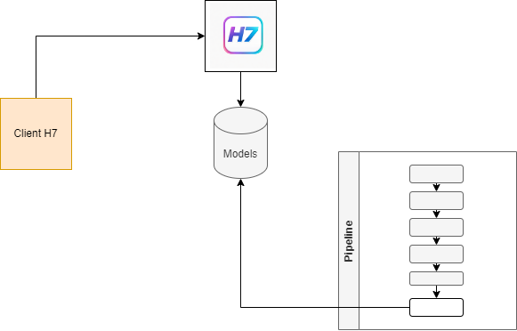

# EPO CodeFest -- H7 Heptagon Demo UI

Lightweight Flask web interface to interact with the H7 Model Governance
API.

This application provides a simple and transparent way to manually call
the ML inference endpoint (`/api_h7/<context>`) and inspect both inputs
and outputs in a controlled environment.

The goal is not production deployment, but evaluation, experimentation
and demonstration within the EPO CodeFest context.



------------------------------------------------------------------------

## Purpose

This UI was designed to:

-   Provide a human-friendly interface for the ROI / valuation model
-   Make feature ranges and validation explicit and transparent
-   Allow evaluators to test the model without writing code
-   Keep dependencies minimal and deployment simple
-   Demonstrate governance-oriented interaction with the model API

The implementation is intentionally lightweight:

-   No authentication
-   No database
-   In-memory short history (last 10 calls)
-   Validation before API invocation

------------------------------------------------------------------------

## Architecture Overview

The application:

1.  Collects feature inputs via a web form\
2.  Validates ranges locally\
3.  Builds a structured JSON payload\
4.  Calls the inference endpoint\
5.  Displays the response\
6.  Stores a short execution history (in memory)

It acts as a transparent client for the H7 Heptagon model governance
system.

------------------------------------------------------------------------

## Runtime Requirements

-   Python **3.11**
-   Flask \>= 2.3
-   Requests \>= 2.31

------------------------------------------------------------------------

## Setup Instructions

### 1. Create and activate a Python 3.11 environment

``` bash
python3.11 -m venv venv
source venv/bin/activate   # macOS / Linux
# or
venv\Scripts\activate      # Windows
```

------------------------------------------------------------------------

### 2. Install dependencies

``` bash
pip install -r requirements.txt
```

------------------------------------------------------------------------

### 3. Run the application

``` bash
python app.py
```

------------------------------------------------------------------------

### 4. Access the Web Interface

Once started, the application will be available at:

    http://localhost:5000/

------------------------------------------------------------------------

## Notes

-   This uses the Flask development server.
-   For production environments, use a WSGI server such as Gunicorn.
-   The API endpoint defaults to `http://localhost:8000/api_h7/<model_context>`
    but can be modified from the UI.
	
	


------------------------------------------------------------------------

## CodeFest Context

This demo UI complements the H7 -- Heptagon Model Governance Framework
by:

-   Demonstrating structured model interaction\
-   Enforcing feature validation boundaries\
-   Enabling reproducible manual evaluation\
-   Providing governance-aware model invocation

Seven pillars. One valuation engine.
