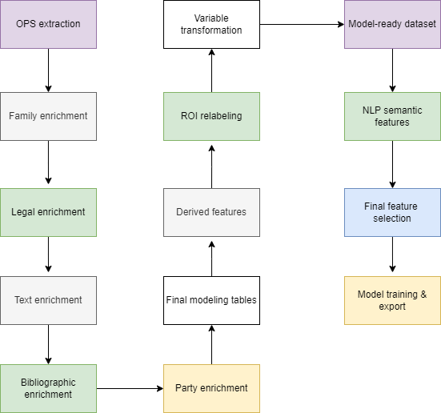

# EPO CodeFest 2026  
## Patent Portfolio evaluation – ROI Modeling Pipeline

---

## Project Overview

This project implements a **fully reproducible end-to-end patent portfolio valuation pipeline**, starting from raw data extraction via **EPO OPS** and ending with a production-ready trained model exported as a `.pkl` artifact.

The objective is to:

- Retrieve patent data from **EPO OPS**
- Enrich bibliographic, legal, family and textual features
- Engineer structured valuation features
- Add semantic NLP signals using transformer embeddings
- Train a winning Ridge regression model
- Export a production-ready artifact with metadata

---

# End-to-End Pipeline Sequence

The full execution order is defined in:

```
script_pipeline.sh
```

Execution flow:




---

# Detailed Step Order

##  Stage 1 — OPS Data Extraction & Enrichment

1. `10_build_dataset_from_ops.py`  
2. `11_enrich_family.py`  
3. `12_enrich_legal.py`  
4. `13_enrich_text.py`  
5. `14_enrich_biblio_light.py`  
6. `15_enrich_biblio.py`  
7. `16_enrich_parties.py`  
8. `17_enrich_text.py`  

---

##  Stage 2 — Feature Engineering

9. `20_build_final_tables.py`  
10. `21_add_derived_features.py`  
11. `22_relabel_roi_v3.py`  
12. `23_transform_variables.py`  
13. `24_build_model_tablon.py`  
14. `25_build_nlp_tablon.py`  

---

##  Stage 3 — NLP Semantic Layer

15. `26_build_model_tablon_nlp.py`  
16. `27_build_model_tablon_final.py`  

---

##  Stage 4 — Model Training & Export

17. `30_model_export_to_pkl.py`  

Final production artifact:

```
data/models/winner_model/winner_model_prod.pkl
```

---

# Pipeline Execution

To execute the full modeling pipeline, ensure that the following prerequisites are met:

- All Python dependencies listed in `requirements.txt` have been installed in the active environment.
````bash
pip install -r requirements.txt
````
- The environment operates within the EPO technical framework and has access to OPS services.
- Valid OPS credentials are correctly configured in the `.env` file under foder `scripts`.
- Network access to EPO OPS is available.

## Python Environment Setup

Python 3.10+ is recommended.

Create and activate a virtual environment:

```bash
python -m venv venv
source venv/bin/activate        # Linux / macOS
venv\Scripts\activate           # Windows
pip install -r requirements.txt
```

---

#  OPS Requirements

To access EPO OPS you need:

- Valid OPS credentials (consumer key + secret)
- Proper authentication handler
- OPS HTTP wrapper
- CQL-compatible query encoding
- Respect of OPS rate limiting policy

The pipeline includes exponential backoff for `403 RobotDetected` responses.

---

#  Environment Setup

## Python Version

Recommended:

```
Python 3.10+
```

## Install Dependencies

From project root:

```bash
pip install -r requirements.txt
```

---

#  Running the Full Pipeline

From project root:

```bash
bash script_pipeline.sh
```

The pipeline will:

- Stop immediately if any stage fails
- Generate all intermediate parquet files
- Train and export the final model
- Copy winner model into production folder

Final output:

```
data/models/winner_model/winner_model_prod.pkl
```

---

#  Modeling Strategy

Final model:

- Ridge Regression
- Median imputation
- Standard scaling
- Numeric-only feature space
- ROI proxy v3 target
- NLP semantic features integrated
- Reference baseline model for comparison
- Hyperparameter optimization with Change-Budget L2 Regularization to enhance training stability and lifecycle governance.
### Methodological reference:
[Regularization by Change Budget: Controlling Model Adaptation via Constrained Optimization](https://zenodo.org/records/18498852)

---

#  Project Structure

```
├── API_modelo_ROI
│   ├── app
│   ├── backups
│   ├── database
│   ├── docker
│   └── modelos
├── data
│   ├── interim
│   ├── models
│   └── processed
├── Epo_client_web
│   ├── static
│   ├── templates
│   └── tests
├── docs
│   ├── memory
├── imagenes
├── notebooks
├── script
├── src
├── Videos
requirements.txt
script_pipeline.sh
README.md
```

---

#  Reproducibility

The exported model metadata includes:

- Feature list
- Dataset path
- Python version
- sklearn version
- pandas version
- numpy version
- UTC export timestamp

---

#  Industrial Readiness

This pipeline is:

- Deterministic  
- Modular  
- Scriptable  
- CI/CD compatible  
- Containerizable  
- Production export ready  

## Model Deployment and Exploitation

The final winner model, located at:
````bash
data/model/winner_model/winner_model_prod.pkl
````

Can be loaded into the Model Manager by starting the Docker container defined in the `API_modelo_ROI` directory.

The `API_modelo_ROI` module contains the full model registry and REST serving infrastructure. It operates as an MLflow-style model manager and is fully documented in its own `README.md`, where detailed configuration, deployment and usage instructions are provided.

Once the Docker container is running, the winner model can be registered, activated under a specific context, and exposed as a production REST service.

The deployed model can then be consumed by the client application located in:


---

## Full Technical Report]

[Full Technical Report](docs/Technical_Report_CodeFest_2026_Real_Value_of_a_Patent_v1.pdf)

Developed for **EPO CodeFest 2026 – Patent & IP Portfolio (e)valuation** by Diego Sánchez de la Fuente
