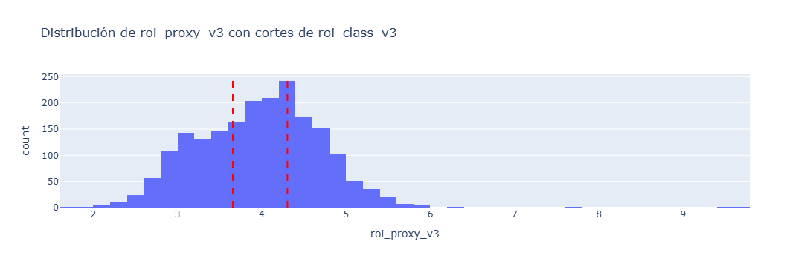
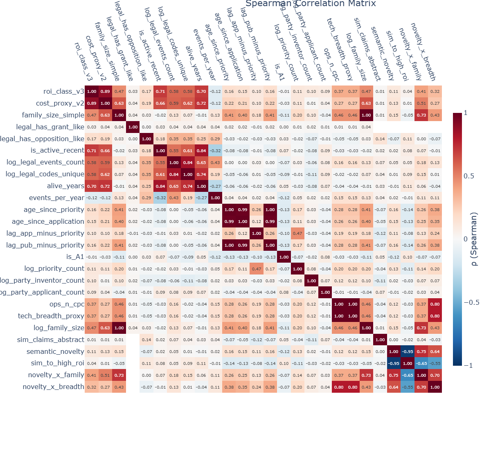
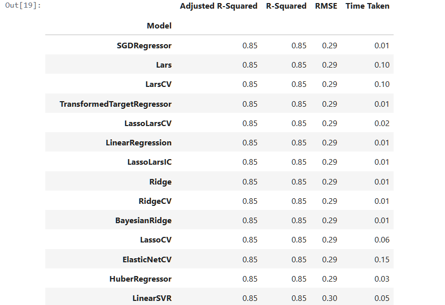
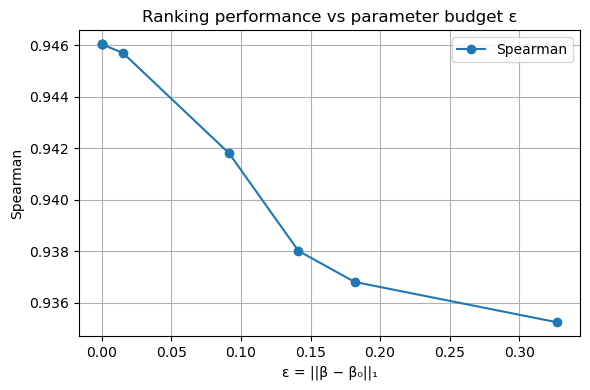
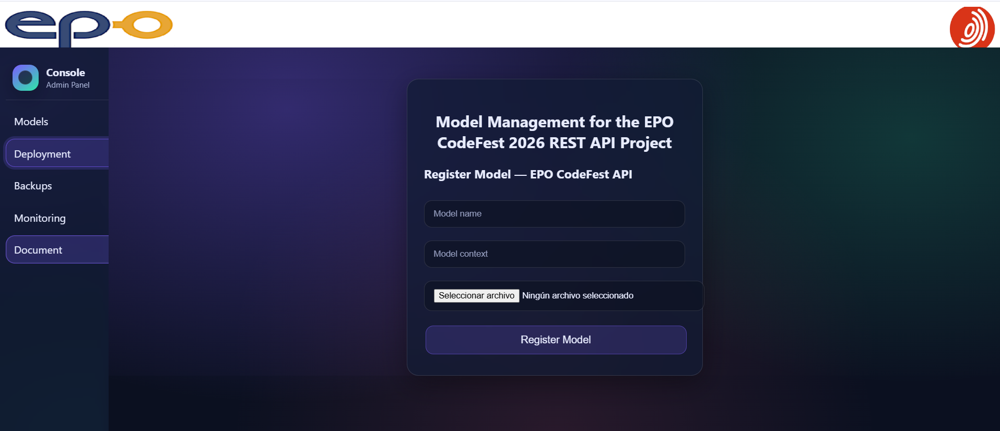
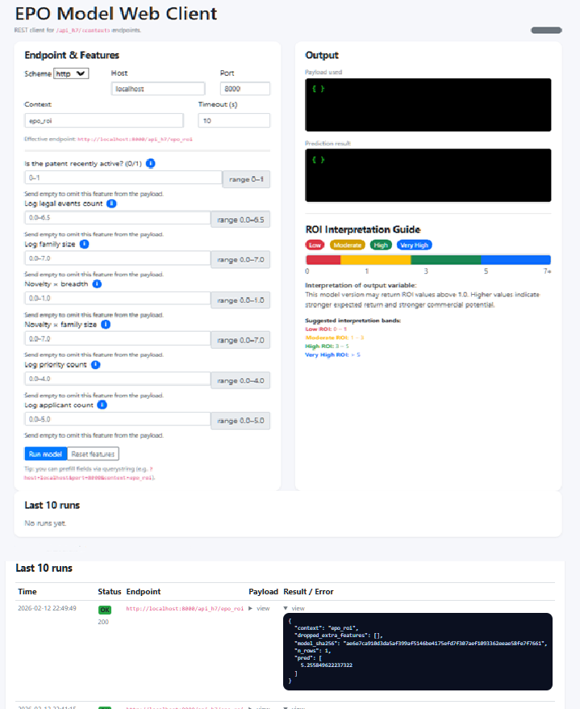
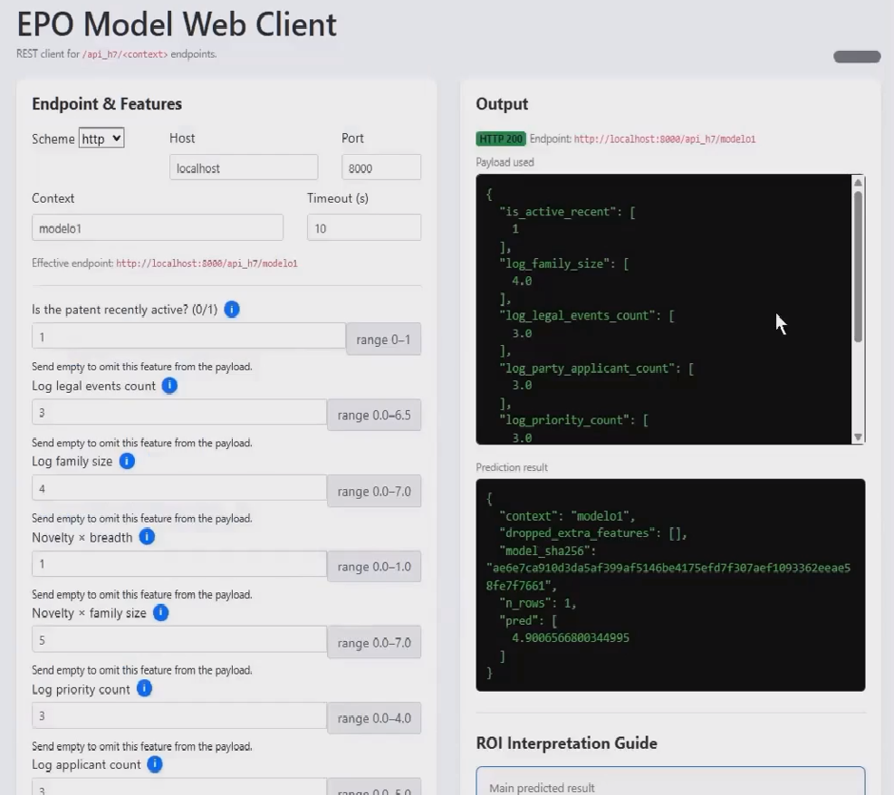

```{r setup, include=FALSE}
knitr::opts_chunk$set(echo = TRUE)
```


\newpage


# Introduction: Real Value of a Patent

This project, submitted to EPO CodeFest 2026, starts from a fundamental idea: a patent is an asset, but its real value is not directly observable. In practice, valuation is constructed from indirect signals of a technical, legal, organizational, and temporal nature. These signals are usually analyzed by experts, but in a way that is not very systematic and is hardly reproducible when working with large portfolios.

The objective of this work is to propose a reproducible analytical framework that allows patents to be evaluated and prioritized within a portfolio. The approach does not aim to replace expert judgment, but to strengthen it through a data-driven analysis that is consistent, explainable, and traceable. The ultimate purpose is to facilitate strategic decision-making supported by observable evidence.

## The valuation problem in patent portfolios (a patent’s ROI)

In patent portfolio management, recurring decisions arise related to maintenance, international extension, legal defense, or exploitation of assets. These decisions are often made under budget constraints and with incomplete information, which increases the risk of inefficiencies.

The main challenge is that the value of a patent is a multidimensional phenomenon. It can reflect technological complexity, strategic ambition, accumulated investment, legal persistence, or potential economic return. In addition, value is usually distributed very unevenly within a portfolio, concentrating on a small number of assets. Without a systematic way to order and compare, it is difficult to clearly identify which ones deserve greater attention.

## General project approach

The project adopts an approach based on observable and measurable signals. Instead of assuming that a single variable determines value, it starts from the hypothesis that value emerges from the interaction between different dimensions. To capture that interaction, the available information is organized into coherent conceptual blocks that are analyzed jointly.

Broadly speaking, the framework integrates information related to technological classification and its diversity, the structure and extension of the patent family, legal history and status, the organizational complexity of the involved actors, and certain documentary characteristics. Each of these blocks provides a partial perspective, but their combination makes it possible to build a richer and more operational reading of a patent’s potential value.

## Practical contribution of the work

The main result of the project is the transformation of a patent portfolio into a set of interpretable indicators that facilitate asset prioritization. This is not only about producing a ranking, but about being able to explain why an asset appears in a certain position, which signals contribute to it, and how they relate to each other.

Explainability is a key element, since decisions about patent portfolios are usually justified to diverse profiles, including engineers/technical experts, legal professionals, and management stakeholders. The proposed approach aims to serve as a common language among these profiles, relying on transparent and reasoned metrics.

## Scope and Limitations

This work does not aim to estimate with absolute precision the future economic return of each patent. Its scope is to provide a decision-support tool that enables coherent ranking, comparison, and analysis of patent portfolios, reducing noise and arbitrariness.

In this project, no exhaustive optimisation of the model has been pursued with the sole objective of maximising predictive accuracy. Within the context of the EPO CodeFest and the pipeline, the priority has been to build a stable, reproducible, and governable model.

An aggressive optimisation strategy might have slightly improved performance metrics, but at the cost of increased complexity and a higher risk of overfitting. Therefore, an explicit regularisation approach has been adopted to control coefficient magnitude and promote interpretability, traceability, and system sustainability.

The result is a deliberately balanced model: sufficiently accurate to support prioritisation, yet primarily designed to be maintainable, explainable, and robust over time.

The conclusions should be interpreted as analytical and indicative, conditioned by the quality and availability of the data. Even so, the proposed framework contributes to improving consistency, traceability, and efficiency in patent portfolio evaluation.

## Document structure

After this introduction, the document describes the process of obtaining and preparing the data, detailing the pipeline used. Next, the analyses performed and the results obtained are presented, as well as the methodological decisions that support the adopted approach.


# Pipeline

The proposed pipeline follows a reproducible and modular architecture oriented to model lifecycle governance.

In a first phase, data preparation is performed, including robust imputation of missing values, logarithmic transformation of count variables, and normalization through standard scaling. The feature space is limited to structural numeric variables derived from the case file.

Subsequently, a Ridge Regression base model is trained, selected for its stability, interpretability, and variance control. On top of this model, the Change-Budget Regularization (L2) approach is applied, introducing an explicit constraint on the magnitude of parameter updates, guaranteeing temporal stability and coherence in retraining scenarios.


[Regularization by Change Budget: Controlling Model Adaptation via Constrained Optimization](https://zenodo.org/records/18498852)


The result is a traceable, reproducible system aligned with principles of algorithmic governance.

\clearpage

The following diagram shows the steps (stages) of the model generation pipeline for estimating the ROI of a patent portfolio.


\newpage

# Notebooks

## Robust ROI proxy (roi_proxy_v3)

The starting point of the analysis is an initial measure of economic return, referred to in this work as ROI. This quantity should not be interpreted as a real economic value in an accounting sense, but as a **quantitative approximation** built from observable signals of the patent system. Its function is to serve as a reference variable for exploratory analysis and subsequent modeling.

It is important to note that this approximation is not arbitrary. In a real operational context, the ROI value used could correspond to an estimate validated or adjusted through **expert judgment**, for example based on internal evaluations, historical strategic decisions, or previous exploitation analyses. The proposed framework is compatible with that scenario, since the initial ROI can be interpreted as an observed, approximated, or consensual value, on top of which analytical adjustments are applied.

Formally, we start from a first approximation to return, denoted as \( ROI^{(1)} \), which represents the base value associated with each patent:

\[
ROI^{(1)} \approx \text{Estimated economic return of the patent}
\]

This magnitude is progressively refined by incorporating additional information from the system, giving rise to a second intermediate version \( ROI^{(2)} \), which integrates structural and contextual signals derived from the exploratory analysis.

From this second approximation, the project introduces a **robust ROI proxy**, denoted \( ROI^{(3)} \), whose objective is to explicitly penalize the estimated return as a function of the cost associated with maintaining and extending the patent. This adjustment makes it possible to balance expected return and economic effort, aligning the metric with a more realistic interpretation of net value.

In its penalized form, the proxy is defined as:

\[
ROI^{(3)} = ROI^{(2)} - \lambda \cdot COST
\]

where \( COST \) represents an approximation to the cost associated with the patent and \( \lambda \) acts as a penalty parameter that controls the intensity of the adjustment.

Alternatively, a normalized form is used that avoids negative values and allows a more stable relative interpretation:

\[
ROI^{(3)} = \frac{ROI^{(2)}}{1 + \lambda \cdot COST}
\]

This normalized formulation is especially suitable for comparative analysis within a portfolio, as it introduces a smooth and continuous penalty that preserves the relative ordering between assets.

Using \( ROI^{(3)} \) as a robust proxy makes it possible to explicitly incorporate the notion of cost in the evaluation of value, without losing traceability or interpretability. In this way, the final metric maintains economic coherence, is compatible with expert validation, and is suitable as a target variable or reference in later phases of the project.

Exploratory analysis constitutes the first analytical phase of the project and aims to understand the real structure of the patent table before any modeling. At this point the goal is not yet to explain or predict the value of a patent, but to identify patterns, scales, relationships, and possible limitations of the available data. This step is essential to ensure that subsequent decisions rely on consistent signals and not on implicit assumptions.

## Exploratory Data Analysis (EDA)

The analysis begins with a review of the temporal variables associated with each patent, in particular the filing and publication dates and the derived intervals between relevant milestones. These variables allow each asset to be placed within its lifecycle and reveal the temporal heterogeneity of the set. At this point, it is especially informative to include a chart of the distribution of patent age, as it highlights the coexistence of recent assets with others of long trajectory—something common in real portfolios and relevant for interpreting value.

Next, variables that act as the target or as direct approximations of economic return are analyzed, when available. The analysis shows that these variables present highly asymmetric distributions, with long tails and a strong concentration of low values. This behavior is consistent with real economic phenomena, where a minority of assets concentrates much of the impact. A visualization of these distributions, preferably on a logarithmic scale, helps to understand why transformations will be necessary before any modeling and avoids misleading interpretations based on simple means.


As an improvement to the project, optimizing the data acquisition strategy is proposed through a more randomized and representative sampling scheme. In the current implementation, understanding and exploiting the OPS API required considerable effort, which partially conditioned the way in which the observations used in the model were collected.

In future iterations, it would be desirable to incorporate a more systematic and statistically balanced extraction mechanism, ensuring greater technological diversity, better temporal coverage, and a reduction of possible biases derived from the download procedure. This would strengthen training robustness and the model’s generalization capacity over the overall set of patents.


In the previous figure, the distributions of the values of the different ROI proxies proposed in this work can be observed.


In the previous figure, we observe the distribution of the ROI v3 proxy as a function of each ROI_CLASS value, both as a violin plot and as a scatter plot.



In the previous chart, we can observe the distribution of values for proxy_roi_v3 compared with roi_class.

From the observed distribution of roi_proxy_v3, it can be seen that most patents concentrate in an approximate range between 3 and 5, with a relatively symmetric unimodal distribution and a few isolated extreme values in the right tail.

Although the indicator is theoretically bounded over a wider range, in the analyzed sample the effective values mostly lie within that central interval. Values above 5 can be considered part of the high end of the distribution, representing cases with higher estimated relative return with respect to the investment made, although they do not necessarily constitute the maximum observed.

The cut points defined for roi_class_v3 make it possible to segment the distribution into interpretable ranges within the model’s analytical framework.


In the previous figure, we observe the distribution of proxy_roi_v3 values for each of the values of party_applicant_hype_main.

For the choice of the target variable, proxy_roi_v3 has been used, as it is considered the most robust approximation available. This indicator integrates a set of observable structural variables (such as recent activity, family size, legal events, priorities, or technological breadth) that act as quantifiable signals of a patent’s potential value.

It should be noted that this is a calculated variable, designed to approximate the real value of a patent under a systematic and reproducible framework. However, it could be replaced or complemented by expert judgment in contexts where specialized qualitative evaluation is available.


The analysis continues with variables related to the actors involved in the patent, such as the number of applicants and inventors. These variables are interpreted as indirect signals of organizational complexity and investment effort. It is observed that most patents present simple structures, while a reduced subset shows greater complexity. A scatter plot or a comparative distribution makes it possible to clearly visualize this heterogeneity and explore its preliminary relationship with other value signals.

In the technological domain, classification information is studied, both in terms of the number of assigned classes and technological diversity. This block is key to approximating technical complexity and breadth of protection. The exploratory analysis reveals that many patents concentrate in few classes, while others combine multiple technological domains. Including a chart that shows the distribution of the number of classes per patent facilitates understanding of this variability and its possible role as a differentiating signal within the portfolio.

Another central axis of the analysis is the patent family and its international extension. Variables such as family size or number of jurisdictions reflect strategic decisions that imply sustained costs. The exploratory analysis shows that most patents are not extended widely, while some show a clear international bet. A visualization of the family size distribution is especially useful to illustrate this asymmetry and its possible connection with return expectations.

The study of legal history and legal status adds a dynamic dimension to the analysis. The number of legal events and their temporal distribution allow approximating the level of administrative activity and maintenance of the asset. The analysis shows great variability in this aspect, from patents with little activity to others with a dense history. Graphically representing the number of legal events per patent helps identify this pattern and reinforces the interpretation of legal activity as a value signal or strategic monitoring.

From legal history, derived temporal metrics are built, such as event frequency or administrative intensity. These variables are not directly available in the original data, but they significantly enrich the analysis by introducing dynamic information. A chart relating these metrics to age or other key signals allows anticipating their usefulness in later phases of the project.

Finally, the exploratory analysis addresses basic characteristics of patent text, such as the length of the title, abstract, and full text when available. Although these metrics are simple, they act as indirect proxies for informational density and technical complexity. The analysis shows that these lengths also present asymmetric distributions, so a comparative visualization is useful to contextualize their role before introducing more advanced techniques such as semantic embeddings.

Overall, this exploratory analysis makes it possible to understand the real structure of the patent table, identify necessary transformations, justify variable selection, and document analytical decisions transparently. More than producing definitive conclusions, this phase lays the methodological foundations for the rest of the project and acts as a bridge between data acquisition and explainable modeling of patent value.

In this notebook, hypothesis tests are also presented that help us select the best features for the model, that is, those that truly explain ROI (the target variable).


## Natural Language Processing techniques (NLP feature engineering)

The notebook implements a feature engineering analysis based on natural language processing applied to patent descriptive texts.

First, basic text cleaning is performed (normalization, noise removal, and tokenization). Subsequently, semantic representations are extracted through vector techniques, generating numeric variables that capture latent information from technological content.

These features are integrated into the structural space of the model, allowing the legal and procedural variables to be complemented with signals derived from textual content.

The result is a set of reproducible features that enrich the estimation of proxy_roi_v3 without introducing excessive complexity into the pipeline.


As an evolution of the system, the construction of a RAG module is proposed, based on a vector database of embeddings generated from all patent texts including title, abstract, description, and claims. This semantic repository would act as a universal language that would make it possible to identify deep technological similarities between cases and detect patterns historically associated with high or low proxy_roi_v3 values. Integrating this module would enrich the model with semantic similarity signals and would improve explainability by retrieving comparable cases capable of contextualizing and supporting the ROI estimate beyond the structural factors currently considered.


## Feature selection (predictor variables)

This notebook implements the construction of the space of structural variables used by the model. From the raw case data, robust transformations are generated aimed at capturing legal intensity, recent activity, family size, priorities, and legal events.

Logarithmic transformations are applied to count variables to stabilize variance and reduce asymmetries, as well as combinations and interactions between relevant variables in order to reflect non-linear relationships within a regularized linear framework. The result is a coherent set of numerical features prepared for direct integration into the training pipeline.

The process is designed to be reproducible, traceable, and aligned with model governance principles, ensuring consistency between training, validation, and deployment.



With the resulting set of characteristics, a Ridge Regression base model is built, which acts as a stable and reproducible reference for estimating proxy_roi_v3. This model makes it possible to evaluate the incremental contribution of new variables and maintain coherence in later phases of optimization and governance.

The predictive variables selected for the model are the following:

`is_active_recent`  
Binary variable indicating whether the patent has had recent activity (e.g., legal events or maintenance actions in recent years). It acts as a proxy for economic validity or continued interest from the applicant.

`log_legal_events_count`  
Logarithm of the total number of legal events associated with the patent. It captures the administrative and strategic intensity of the file (oppositions, validations, renewals, etc.), reducing skewness through logarithmic transformation.

`log_family_size`  
Logarithm of the patent family size. It serves as an indicator of international strategy and value expectation, as broader territorial protection typically implies higher investment and potential relevance.

`novelty_x_breadth`  
Interaction variable between the technical novelty index and the breadth of claims. It models the combined effect of originality and legal scope, approximating the differentiated potential of the invention.

`novelty_x_family`  
Interaction between technical novelty and family size. It reflects cases where a highly novel invention is also internationally protected, potentially amplifying its strategic relevance.

`log_priority_count`  
Logarithm of the number of claimed priorities. It captures strategic complexity and possible accumulation of prior developments, stabilising scale through logarithmic transformation.

`log_party_applicant_count`  
Logarithm of the number of applicants or associated parties. It acts as a proxy for collaboration, organisational capacity, or institutional/corporate backing of the technological project.

## Direction of the Effect on `proxy_roi_v3`

In the regularised model `proxy_roi_v3`, the estimated relationship between the predictor variables and the proxy is as follows:

`log_family_size`  
Direct positive relationship. The larger the patent family size, the higher the estimated proxy value.

`novelty_x_breadth`  
Direct positive relationship. A higher combined level of technical novelty and claim breadth increases the proxy.

`novelty_x_family`  
Direct positive relationship. International protection amplifies the effect of novelty.

`log_legal_events_count`  
Direct positive relationship. A greater intensity of legal events is associated with a higher estimated proxy value.

`is_active_recent`  
Direct positive relationship. If the patent shows recent activity, the proxy increases compared to inactive patents.

`log_party_applicant_count`  
Moderate direct positive relationship. A higher number of applicants tends to increase the proxy, although with a more limited effect.

`log_priority_count`  
Weak direct positive relationship. A higher number of claimed priorities contributes slightly to an increase in the proxy.


## Training robust models

This notebook extends the base model by training more complex configurations in order to evaluate stability, predictive capacity, and sensitivity to data variations. Different approaches are compared under a controlled framework, keeping the previously defined regularized linear model as a reference.

The analysis focuses on the robustness of performance, the consistency of coefficients, and stability against changes in the training set. This process makes it possible to validate that observed improvements are not due to overfitting, but to real structural signals present in the data.

The results reinforce the choice of a regularized and governable model as a balanced solution between explanatory capacity and temporal stability.




## L2 regularization by change budget for the finalist model

This notebook implements the methodological core of the project: applying the Change-Budget Regularization (L2) approach on top of the previously defined base model. Unlike conventional regularization, this method introduces an explicit constraint on the allowed magnitude of parameter updates with respect to a reference solution.

[Regularization by Change Budget: Controlling Model Adaptation via Constrained Optimization](https://zenodo.org/records/18498852)

The objective is not only to minimize prediction error, but to control model drift in successive retraining processes, guaranteeing structural stability and temporal coherence. In this way, the model not only optimizes performance, but incorporates a formal mechanism of algorithmic governance.

The procedure starts from the coefficients estimated in the base model and applies a constrained optimization that limits the total “change budget” allowed on the parameters. This formulation makes it possible to balance adaptation and stability, reducing the risk of abrupt oscillations when faced with new observations or changes in the data distribution.

\clearpage

The experiments performed show that the approach maintains competitive levels of predictive performance while significantly improving parametric stability, reinforcing interpretability and system traceability.


From a conceptual perspective, the approach can be understood as a path within a solution space where it is not allowed to move arbitrarily in any direction. The model starts from a reference position and can adapt, but only within a previously defined “movement budget”. In this sense, the optimization does not seek the fastest exit from the labyrinth, but a controlled trajectory that preserves structural coherence and temporal stability.

\clearpage

In the following chart, the usefulness of L2 regularization by change budget applied to the patent ROI estimation project is shown.





The figure shows the evolution of Spearman correlation as a function of the change budget $\varepsilon$ ($\varepsilon = \lVert \beta - \beta_0 \rVert$). It can be observed that performance is maximum when the model barely deviates from the reference solution and progressively decreases as greater deviation is allowed.

This behavior indicates that the base solution already captures the structure of the problem adequately and that excessive deviations introduce variability that does not improve the ranking, reinforcing the usefulness of the Change-Budget Regularization approach as a control and stability mechanism.

\clearpage

# API_modelo_ROI – H7 Heptagon Model Lifecycle Manager

The `API_modelo_ROI` API is the production component of the H7 – Heptagon project. It is a lightweight model management and deployment system inspired by an MLflow-like approach, designed to expose the winning model as a REST service in a controlled and reproducible environment.

## H7 – Heptagon framework

H7 (Heptagon) represents a structured architecture based on seven pillars: data, features, validation, export, deployment, versioning, and monitoring. This framework guarantees reproducible training, controlled deployment, and full traceability of the valuations generated in the context of the project.

## Model management

The API acts as an internal model manager that allows versions to be registered, associated with a logical context, and internal metadata maintained. The model artifact can be loaded and registered at startup or through the administration interface, facilitating lifecycle control and the safe replacement of models in production.




## REST exposure

The model is exposed as a REST service accessible via:

```text
POST http://localhost:8000/api_h7/<context>
```

\clearpage

# Epo_client_web – Web client for model inference

## General description

The H7 Heptagon Demo UI is a lightweight web interface developed in Flask that allows manual and transparent interaction with the inference endpoint /api_h7/<context>. Its purpose is to facilitate evaluation, experimentation, and demonstration of the model within the context of EPO CodeFest, not its deployment in production.

The application acts as a controlled client of the H7 model governance system. It allows entering input variables through a web form, visualizing the generated JSON, inspecting the model response, and keeping a small in-memory history of the latest executions. This promotes traceability and understanding of system behavior.



\clearpage

## Purpose within the project

The interface is conceived as a support tool for evaluating the ROI and valuation model. It makes explicit the ranges and validation rules of the variables, allowing verification that inputs are within the defined limits before invoking the API.

Evaluators can test different scenarios without needing to write code or use external tools. The design is deliberately simple and transparent, without authentication or a database, keeping only a short in-memory history and performing validations prior to calling the inference service.

## Functional architecture

The flow begins with collecting variables through a web form. Next, the defined ranges for each feature are validated locally. If validation is correct, a structured JSON payload is built and sent to the configured inference endpoint.


\clearpage

The model response is shown in the interface and the execution is temporarily stored in an in-memory history. The application operates as an explicit client of the H7 Heptagon system, focusing on clarity of data exchange, pre-validation, and reproducibility of manual tests.



\clearpage

## Execution requirements

The environment requires Python 3.11 together with Flask version 2.3 or higher and the Requests library version 2.31 or higher.

## Getting started

The application runs in a Python 3.11 virtual environment with dependencies installed from the requirements.txt file. Once started with the command python app.py, the interface is available at http://localhost:5000/.

By default, the inference endpoint points to http://localhost:8000/api_h7/<model_context>, although this configuration can be modified from the interface itself to adapt to different model contexts.

## Contribution to the H7 framework

The Demo UI complements the H7 Heptagon Model Governance Framework by materializing a structured interaction with the model, reinforcing variable validation limits, and enabling reproducible manual evaluation. Its function is to demonstrate how model invocation can be integrated within a clear, verifiable, and controlled governance framework.

Seven pillars. One valuation engine.

\clearpage

# General conclusion

The H7 Heptagon project developed for EPO CodeFest is an end-to-end proposal covering the model, training pipeline, inference architecture, governance framework, and interaction client. It is not only a prediction system, but a complete solution designed from the outset under criteria of traceability, stability, and reproducibility.

At the core of the system is the valuation model, built on a solid and explainable statistical foundation. On top of this base model, the Regularization by Change Budget approach is incorporated, introducing a formal mechanism to control the magnitude of changes with respect to previous versions. This approach not only improves model stability, but also makes it possible to manage its evolution within an explicit governance framework.

The pipeline guarantees coherence between training, validation, and deployment phases. Variable transformations, standardization, imputation, and artifact generation are integrated into a reproducible flow. Containerization of the environment ensures that the system can run in different contexts while maintaining technical and operational consistency.

The H7 API materializes structured access to the model. It defines a clear input/output contract, enabling controlled invocation of the inference system. This separation between model and service layer reinforces modularity and facilitates lifecycle supervision of the model.

The H7 client, developed as a lightweight Flask Demo UI, completes the ecosystem by providing a transparent interface for manual evaluation. It makes validation ranges explicit, allows inspection of the JSON payload, and visualizes model responses in a controlled environment. In this way, interaction is not limited to developers, but is opened to evaluators and non-technical profiles without losing rigor.

The project as a whole articulates four complementary dimensions: methodological robustness, pipeline discipline, architectural clarity, and a governance-oriented approach. These dimensions converge into a proposal that balances predictive performance and institutional control.

H7 Heptagon is not only a valuation engine, but a conceptual and technical framework for managing models responsibly. Seven pillars structure a system designed to evolve without losing stability, to adapt without compromising coherence, and to innovate without giving up transparency.

In summary, the project demonstrates that technical excellence, reproducibility, and model governance can be integrated from the initial design as inseparable parts of the same architecture.
