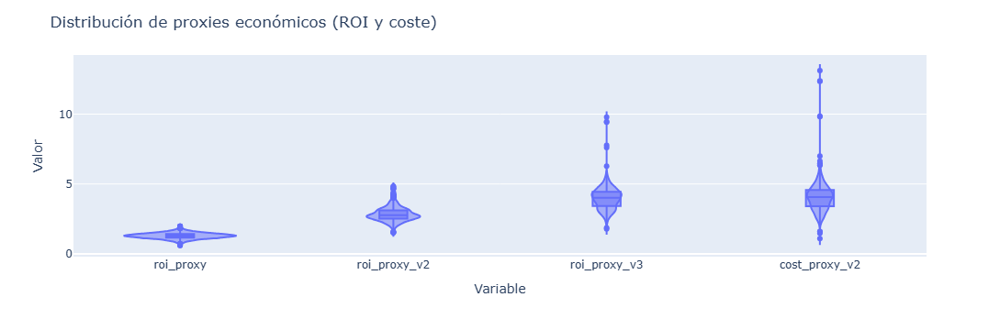
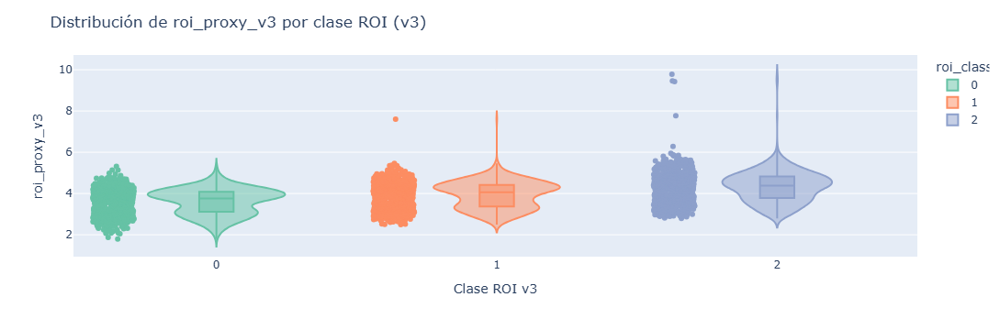
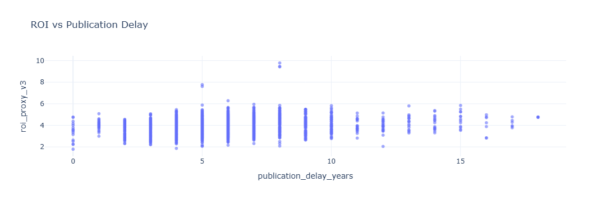
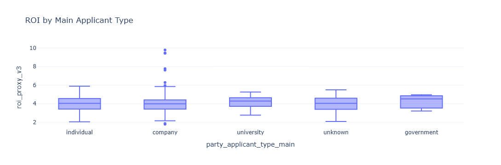

```{r setup, include=FALSE}
knitr::opts_chunk$set(echo = TRUE)
```


\newpage


# Introducción: Valor real de una patente

Este proyecto, presentado al EPO CodeFest 2026, parte de una idea fundamental: una patente es un activo, pero su valor real no es directamente observable. En la práctica, la valoración se construye a partir de señales indirectas de naturaleza técnica, legal, organizativa y temporal. Estas señales suelen analizarse de forma experta, pero de manera poco sistemática y difícilmente reproducible cuando se trabaja con carteras amplias.

El objetivo de este trabajo es proponer un marco analítico reproducible que permita evaluar y priorizar patentes dentro de una cartera. El enfoque no pretende sustituir el criterio experto, sino reforzarlo mediante un análisis basado en datos que sea consistente, explicable y trazable. La finalidad última es facilitar la toma de decisiones estratégicas apoyadas en evidencias observables.

## El problema de la valoración en carteras de patentes

En la gestión de carteras de patentes aparecen decisiones recurrentes relacionadas con el mantenimiento, la extensión internacional, la defensa jurídica o la explotación de los activos. Estas decisiones suelen tomarse bajo restricciones presupuestarias y con información incompleta, lo que incrementa el riesgo de ineficiencias.

El principal reto es que el valor de una patente es un fenómeno multidimensional. Puede reflejar complejidad tecnológica, ambición estratégica, inversión acumulada, persistencia legal o potencial de retorno económico. Además, el valor suele distribuirse de forma muy desigual dentro de una cartera, concentrándose en un número reducido de activos. Sin una forma sistemática de ordenar y comparar, resulta difícil identificar con claridad cuáles merecen mayor atención.

## Enfoque general del proyecto

El proyecto adopta un enfoque basado en señales observables y medibles. En lugar de asumir que una única variable determina el valor, se parte de la hipótesis de que este emerge de la interacción entre distintas dimensiones. Para capturar esa interacción, la información disponible se organiza en bloques conceptuales coherentes que se analizan de forma conjunta.

A grandes rasgos, el marco integra información relativa a la clasificación tecnológica y su diversidad, la estructura y extensión de la familia de patentes, el historial y estado jurídico, la complejidad organizativa de los actores implicados y determinadas características documentales. Cada uno de estos bloques aporta una perspectiva parcial, pero su combinación permite construir una lectura más rica y operativa del valor potencial de una patente.

## Aportación práctica del trabajo

El principal resultado del proyecto es la transformación de una cartera de patentes en un conjunto de indicadores interpretables que facilitan la priorización de activos. No se trata únicamente de generar un ranking, sino de poder explicar por qué un activo aparece en una determinada posición, qué señales contribuyen a ello y cómo se relacionan entre sí.

La explicabilidad es un elemento clave, ya que las decisiones sobre carteras de patentes suelen justificarse ante perfiles diversos, incluyendo técnicos, juristas y responsables de gestión. El enfoque propuesto busca servir como lenguaje común entre estos perfiles, apoyándose en métricas transparentes y razonadas.

## Alcance y limitaciones

Este trabajo no persigue estimar con precisión absoluta el retorno económico futuro de cada patente. Su alcance es proporcionar una herramienta de apoyo a la decisión que permita ordenar, comparar y analizar carteras de forma coherente, reduciendo el ruido y la arbitrariedad.

Las conclusiones deben interpretarse como analíticas y orientativas, condicionadas por la calidad y disponibilidad de los datos. Aun así, el marco propuesto contribuye a mejorar la consistencia, la trazabilidad y la eficiencia en la evaluación de carteras de patentes.

## Estructura del documento

Tras esta introducción, el documento describe el proceso de obtención y preparación de los datos, detallando el pipeline utilizado. A continuación, se presentan los análisis realizados y los resultados obtenidos, así como las decisiones metodológicas que sustentan el enfoque adoptado.

\newpage

# Pipeline


\newpage

# Notebooks


## Proxy de ROI robusto (roi_proxy_v3)

El punto de partida del análisis es una medida inicial de retorno económico, denominada en este trabajo como ROI. Esta magnitud no debe interpretarse como un valor económico real en sentido contable, sino como una **aproximación cuantitativa** construida a partir de señales observables del sistema de patentes. Su función es servir como variable de referencia para el análisis exploratorio y la modelización posterior.

Es importante destacar que esta aproximación no es arbitraria. En un contexto operativo real, el valor de ROI utilizado podría corresponder a una estimación validada o ajustada mediante **criterio experto**, por ejemplo a partir de evaluaciones internas, decisiones estratégicas históricas o análisis previos de explotación. El marco propuesto es compatible con ese escenario, ya que el ROI inicial puede interpretarse como un valor observado, aproximado o consensuado, sobre el cual se aplican ajustes analíticos.

Formalmente, se parte de una primera aproximación al retorno, denotada como \( ROI^{(1)} \), que representa el valor base asociado a cada patente:

\[
ROI^{(1)} \approx \text{Retorno económico estimado de la patente}
\]

Esta magnitud se refina progresivamente incorporando información adicional del sistema, dando lugar a una segunda versión intermedia \( ROI^{(2)} \), que integra señales estructurales y contextuales derivadas del análisis exploratorio.

A partir de esta segunda aproximación, el proyecto introduce un **proxy de ROI robusto**, denominado \( ROI^{(3)} \), cuyo objetivo es penalizar explícitamente el retorno estimado en función del coste asociado al mantenimiento y la extensión de la patente. Este ajuste permite equilibrar retorno esperado y esfuerzo económico, alineando la métrica con una interpretación más realista del valor neto.

En su forma penalizada, el proxy se define como:

\[
ROI^{(3)} = ROI^{(2)} - \lambda \cdot COST
\]

donde \( COST \) representa una aproximación al coste asociado a la patente y \( \lambda \) actúa como parámetro de penalización que controla la intensidad del ajuste.

Alternativamente, se utiliza una forma normalizada que evita valores negativos y permite una interpretación relativa más estable:

\[
ROI^{(3)} = \frac{ROI^{(2)}}{1 + \lambda \cdot COST}
\]

Esta formulación normalizada resulta especialmente adecuada para análisis comparativos dentro de una cartera, ya que introduce una penalización suave y continua que preserva el orden relativo entre activos.

El uso de \( ROI^{(3)} \) como proxy robusto permite incorporar explícitamente la noción de coste en la evaluación del valor, sin perder trazabilidad ni interpretabilidad. De este modo, la métrica final mantiene coherencia económica, es compatible con validación experta y resulta adecuada como variable objetivo o de referencia en las fases posteriores del proyecto.

El análisis exploratorio constituye la primera fase analítica del proyecto y tiene como finalidad comprender la estructura real del tablón de patentes antes de cualquier modelización. En este punto no se busca todavía explicar ni predecir el valor de una patente, sino identificar patrones, escalas, relaciones y posibles limitaciones de los datos disponibles. Este paso resulta esencial para garantizar que las decisiones posteriores se apoyan en señales consistentes y no en supuestos implícitos.

## Análisis exploratorio de los datos

El análisis comienza con una revisión de las variables temporales asociadas a cada patente, en particular las fechas de solicitud, publicación y los intervalos derivados entre hitos relevantes. Estas variables permiten situar cada activo dentro de su ciclo de vida y observar la heterogeneidad temporal del conjunto. En este punto resulta especialmente informativo incluir una gráfica de distribución de antigüedad de las patentes, ya que pone de manifiesto la coexistencia de activos recientes con otros de larga trayectoria, algo habitual en carteras reales y relevante para la interpretación del valor.

A continuación se analizan las variables que actúan como objetivo o como aproximaciones directas al retorno económico, cuando este está disponible. El análisis muestra que estas variables presentan distribuciones altamente asimétricas, con colas largas y una fuerte concentración de valores bajos. Este comportamiento es coherente con fenómenos económicos reales, donde una minoría de activos concentra gran parte del impacto. Una visualización de estas distribuciones, preferiblemente en escala logarítmica, ayuda a comprender por qué serán necesarias transformaciones antes de cualquier modelado y evita interpretaciones engañosas basadas en medias simples.








El análisis continúa con las variables relacionadas con los actores implicados en la patente, como el número de solicitantes y de inventores. Estas variables se interpretan como señales indirectas de complejidad organizativa y de esfuerzo inversor. Se observa que la mayoría de las patentes presentan estructuras simples, mientras que un subconjunto reducido muestra una mayor complejidad. Una gráfica de dispersión o una distribución comparativa permite visualizar claramente esta heterogeneidad y explorar su relación preliminar con otras señales de valor.

En el ámbito tecnológico, se estudia la información de clasificación, tanto en términos de número de clases asignadas como de diversidad tecnológica. Este bloque resulta clave para aproximar la complejidad técnica y la amplitud de protección. El análisis exploratorio revela que muchas patentes se concentran en pocas clases, mientras que otras combinan múltiples dominios tecnológicos. Incluir una gráfica que muestre la distribución del número de clases por patente facilita la comprensión de esta variabilidad y su posible papel como señal diferenciadora dentro de la cartera.

Otro eje central del análisis es la familia de patentes y su extensión internacional. Variables como el tamaño de la familia o el número de jurisdicciones reflejan decisiones estratégicas que implican costes sostenidos. El análisis exploratorio pone de manifiesto que la mayoría de las patentes no se extienden ampliamente, mientras que algunas muestran una clara apuesta internacional. Una visualización de la distribución del tamaño de familia resulta especialmente útil para ilustrar esta asimetría y su posible conexión con expectativas de retorno.

El estudio del historial legal y del estado jurídico aporta una dimensión dinámica al análisis. El número de eventos legales y su distribución temporal permiten aproximar el nivel de actividad administrativa y de mantenimiento del activo. El análisis muestra una gran variabilidad en este aspecto, desde patentes con escasa actividad hasta otras con un historial denso. Representar gráficamente el número de eventos legales por patente ayuda a identificar este patrón y refuerza la interpretación de la actividad legal como señal de valor o de vigilancia estratégica.

A partir del historial legal se construyen métricas temporales derivadas, como la frecuencia de eventos o la intensidad administrativa. Estas variables no están directamente disponibles en los datos originales, pero enriquecen de forma significativa el análisis al introducir información dinámica. Una gráfica que relacione estas métricas con la antigüedad o con otras señales clave permite anticipar su utilidad en fases posteriores del proyecto.

Finalmente, el análisis exploratorio aborda características básicas del texto de la patente, como la longitud del título, del resumen y del texto completo cuando está disponible. Aunque estas métricas son simples, actúan como proxies indirectos de densidad informativa y complejidad técnica. El análisis muestra que estas longitudes presentan también distribuciones asimétricas, por lo que una visualización comparativa resulta útil para contextualizar su papel antes de introducir técnicas más avanzadas como los embeddings semánticos.

En conjunto, este análisis exploratorio permite comprender la estructura real del tablón de patentes, identificar transformaciones necesarias, justificar la selección de variables y documentar decisiones analíticas de forma transparente. Más que producir conclusiones definitivas, esta fase sienta las bases metodológicas para el resto del proyecto y actúa como puente entre la obtención de datos y la modelización explicable del valor de las patentes.


# Entorno de Producción

## Docker Consola EPO CODEFEST

## Despliegue del entorno de ejecución

La aplicación se distribuye mediante contenedores Docker, utilizando *Docker Compose* para garantizar la reproducibilidad y portabilidad del entorno.
Antes de la generación del Docker (contenedor de la consola API EPO CODEFEST), se deberá de asegurar la instalación del software Docker (la versión con la que se ha generado es: 4.43.1 (198352))
La inicialización de la consola encapsulada en un docker se realiza desde el subdirectorio "API_modelo_ROI" del proyecto mediante la construcción de la imagen y el arranque del servicio definido:


```bash
cd project/codefest/API_modelo_ROI
docker compose build --no-cache
docker compose up -d
```


